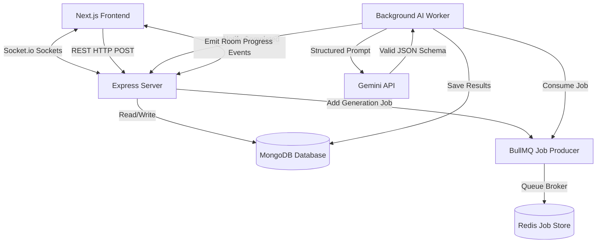

# VedaAI Assessment Creator 🚀

**🔗 Live Demo / Production Link:** [vedaai-assessment-creator-seven.vercel.app](https://vedaai-assessment-creator-seven.vercel.app/)

VedaAI Assessment Creator is a state-of-the-art, production-grade academic assessment creator designed for educational institutions. Powered by Google Gemini AI, it enables teachers to custom-craft highly rigorous, curriculum-aligned student evaluation sheets in seconds, complete with diverse question types, visual difficulty badges, grading rubrics, student/teacher dual views, and pixel-perfect multi-page A4 PDF exporting.

---

## 📖 Table of Contents
1. [Project Overview](#-project-overview)
2. [Tech Stack](#-tech-stack)
3. [System Architecture](#-system-architecture)
4. [Folder Structure](#-folder-structure)
5. [Environment Variables](#-environment-variables)
6. [Setup & Installation](#-setup--installation)
7. [High-Fidelity PDF Export](#-high-fidelity-pdf-export)
8. [Deployment Steps](#-deployment-steps)

---

## 🌟 Project Overview
VedaAI streamlines the examination and homework generation pipeline. Teachers specify an evaluation title, target grade, focus topic, overall difficulty, and dynamic question counts (Multiple Choice, Short Answer, True/False) with specific marks parameters. The application:
- Safely processes requests in background job queues backed by Redis.
- Emits real-time generation progress updates over WebSockets.
- Dispatches prompts to the Google Gemini AI API to yield structured, verified JSON questions.
- Renders an A4 examination sheet with Student Credentials blank lines, grouped sections, difficulty badges, correct keys, and suggested grading rubrics.
- Toggles between **Teacher Mode** (keys visible) and **Student Mode** (blanks visible for exam distribution).
- Generates high-resolution multi-page PDF documents locally inside the browser.

---

## 💻 Tech Stack

### **Frontend Container**
- **Core Framework**: Next.js (v16 App Router)
- **State Management**: Redux Toolkit (Slices for Assignments, Websockets, and Creation forms)
- **Form Architecture**: React Hook Form with Zod schema validation
- **Styling Engine**: Tailwind CSS (v4) & PostCSS
- **Real-Time Websockets**: Socket.io-client
- **PDF Compilation**: `html2canvas` (crystal-clear rasterizer) & `jspdf` (A4 sheet PDF engine)
- **Icon Assets**: Lucide React

### **Backend Container**
- **Runtime Environment**: Node.js & TypeScript
- **Web Framework**: Express
- **Database Indexer**: MongoDB via Mongoose
- **Task Queue & Broker**: BullMQ & IORedis
- **Real-Time Sockets**: Socket.io
- **AI Synthesis**: Google Generative AI (`gemini-2.5-flash` model for fast, structured JSON generation)

---

## 🏗️ System Architecture

VedaAI relies on an event-driven, decoupled background worker architecture to handle AI generation asynchronously, ensuring a highly responsive and failure-tolerant experience.



### **Asynchronous Queue Flow**:
1. **POST Request**: The user submits the Zod-validated creation form. The server creates an assignment in MongoDB with a `generating` status and pushes a generation job onto **BullMQ**.
2. **WebSockets Join**: The client joins a Socket.io room matching the new assignment ID.
3. **AI Worker Ingestion**: The background **BullMQ worker** picks up the job, builds structured instructions, and dispatches them to **Gemini**.
4. **Progress Streaming**: As the worker executes, it emits Socket.io progress events (`generation-started`, `generation-progress`, `generation-completed`) dynamically updated in the Redux store.
5. **Real-time Transition**: When the worker saves the questions to MongoDB and fires completion, the frontend switches the card loader state seamlessly to the complete exam sheet.

---

## 📁 Folder Structure

```
vedaai-assessment-creator/
├── frontend/                     # Next.js App Router (TypeScript)
│   ├── public/                   # Static assets, emblems, empty illustrations
│   ├── src/
│   │   ├── app/                  # Route layouts, pages, and context providers
│   │   │   ├── assignments/      # Dashboard and dynamic assessment paths
│   │   │   │   ├── [id]/         # Printable evaluation sheet & PDF compiler
│   │   │   │   └── create/       # React Hook Form / Zod creation setup
│   │   │   ├── globals.css       # Core design styles & print media directives
│   │   │   ├── layout.tsx        # Shell wrapping providers & shared sidebars
│   │   │   └── providers.tsx     # Unified Redux & Socket.io contexts
│   │   ├── components/           # Desktop Sidebar, Header, Mobile capsule nav
│   │   ├── redux/                # RTK Store configs and slices
│   │   ├── hooks/                # Redux dispatch typed hooks
│   │   └── types/                # Question, Assignment TypeScript schemas
│   ├── package.json
│   ├── tailwind.config.ts
│   └── tsconfig.json
│
├── backend/                      # Node.js Express API (TypeScript)
│   ├── src/
│   │   ├── config/               # Database, Redis broker, Socket initializers
│   │   ├── controllers/          # Route controller request handlers
│   │   ├── models/               # Mongoose database Schemas (Assignment, Question)
│   │   ├── routes/               # Express API endpoints mapping
│   │   ├── services/             # Gemini prompt builders and regex JSON parsers
│   │   ├── workers/              # BullMQ queue job consumer workers
│   │   └── index.ts              # Express Server entry-point
│   ├── package.json
│   └── tsconfig.json
```

---

## 🔑 Environment Variables

To configure VedaAI, set up `.env` files inside both directories:

### **Backend (`/backend/.env`)**
Create `/backend/.env` with:
```env
PORT=5000
MONGO_URI=mongodb://localhost:27017/vedaai
REDIS_HOST=localhost
REDIS_PORT=6379
GEMINI_API_KEY=your_google_gemini_api_key
```
> **Note**: If `GEMINI_API_KEY` is not provided or is left as `MOCK_KEY`, the backend automatically falls back to a high-fidelity mock AI assessment compiler so that the generation pipelines function completely offline.

### **Frontend (`/frontend/.env.local`)**
Copy `frontend/.env.local.example` to `frontend/.env.local`:
```env
NEXT_PUBLIC_API_URL=http://localhost:5000
```
The frontend uses this URL for REST API calls and Socket.io connections.

---

## 🚀 Setup & Installation

Follow these absolute local setup and launch instructions to run VedaAI Assessment Creator on your system:

### **Prerequisites**
Ensure you have the following installed:
- **Node.js** (v18.0.0 or higher)
- **Docker Desktop** (Active and running to spin up database and cache containers)

---

### **Step 1: Setup Environment Files (.env)**
VedaAI is configured to read environment configurations dynamically. Open a terminal inside your repository root folder and run:

```powershell
# Copy the backend template to active local env
Copy-Item backend/.env.example backend/.env

# Copy the frontend template to active local env
Copy-Item frontend/.env.example frontend/.env.local
```

> **Offline Mode Active**: Your local `backend/.env` is pre-configured with `GEMINI_API_KEY=MOCK_KEY`. This lets you run the entire WebSocket, BullMQ background queue, and PDF download pipeline fully offline on your laptop with highly realistic mock questions without needing an active internet connection or Gemini subscription! If you want to use the real AI, simply replace `MOCK_KEY` with your active Gemini API key.

---

### **Step 2: Spin Up Infrastructure (MongoDB & Redis via Docker)**
VedaAI uses **Docker Compose** to run both the database (MongoDB) and task broker (Redis) in fully isolated Linux containers.

1. Make sure **Docker Desktop** is open and active (verify that the engine icon in the bottom-left is green/Running).
2. Open a terminal inside your repository root folder and start the services:
```bash
docker compose up -d
```
This single command spins up:
- **`mongodb-vedaai`**: MongoDB running on default port `27017` with persistent volume storage (`mongo_data`).
- **`redis-vedaai`**: Redis running on default port `6379` backed by the lightweight Alpine image.

*(To stop both database services later, simply run `docker compose down` in your root folder).*

---

### **Step 3: Launch the Backend Server**
Open a new terminal window, navigate to the `/backend` folder, install dependencies, and launch the API server and BullMQ background worker:
```bash
cd backend
npm install
npm run dev
```
👉 Look for: `[VedaAI] Server is actively running on port 5000` and `Assignment BullMQ Worker initialized`.

---

### **Step 4: Launch the Frontend Portal**
Open a separate terminal window, navigate to the `/frontend` folder, install dependencies, and launch the Next.js App Router:
```bash
cd frontend
npm install
npm run dev
```
👉 Look for: `Local: http://localhost:3000` and `✓ Ready`. Open your browser and navigate to **`http://localhost:3000`** to view and test all features!

---

## 📄 High-Fidelity PDF Export
VedaAI implements a professional local PDF compilation engine. Instead of triggering raw, unstyled browser prints, clicking **Download PDF**:
1. Dynamically imports `html2canvas` and `jsPDF` at runtime to ensure zero hydration issues.
2. Strips browser-only stylings (rounded card corners, drop shadows, grey border lines) temporarily for a pristine document canvas.
3. Renders the DOM sheet to a high-resolution canvas scaled at `scale: 2` (double-resolution) to keep texts vector-sharp.
4. Distributes the resulting graphic cleanly across A4 pages utilizing a height-ratio shifting loop.
5. Displays a blurred glassmorphic progress spinner to provide premium interaction feedback.

---

## ☁️ Deployment Steps

VedaAI is fully optimized for cloud deployment. Follow these industry standards:

### **1. Production Builds**
Compile TypeScript and bundle resources before deployment:
```bash
# Inside /frontend
npm run build

# Inside /backend
npm run build
```

### **2. Database & Cache Hosting**
- **MongoDB**: Use **MongoDB Atlas** for managed, highly available database clustering.
- **Redis**: Use **Upstash Redis** or **Redis Labs** to host serverless/managed Redis caches.

### **3. Hosting Portals**
- **Frontend App**: Deploy the `/frontend` package to **Vercel** or **Netlify**. Ensure `NEXT_PUBLIC_API_URL` points to your active server url.
- **Backend API & Queue Workers**:
  - Deploy `/backend` to **Render**, **Railway**, or **Heroku**.
  - **Critical**: Ensure the host allows background process executions so that the **BullMQ Background Worker** can safely process jobs asynchronously without thread starvation.
  - Set up environment variables on the cloud provider portal matching the local production keys.
